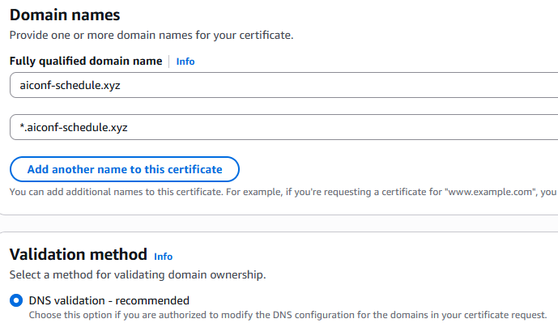
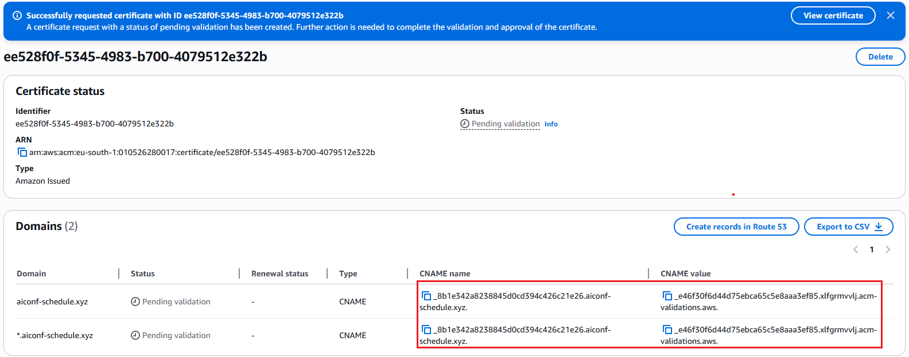
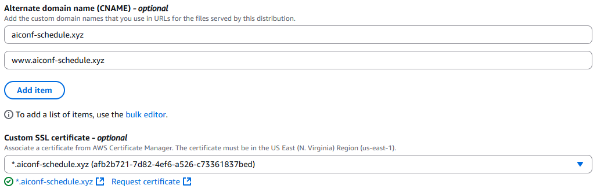
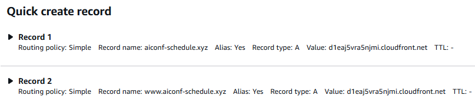

# Step by Step: Hosting static website su S3 + CloudFront

---

## 1. Creazione del bucket S3

Prima di tutto creiamo il bucket e inseriamo al suo interno i file necessari:

Mi sono assicurato che l’accesso pubblico non fosse bloccato e ho aggiunto la policy:

---

## 2. Abilitazione dell’hosting statico

A questo punto ho abilitato l’hosting, in modo da ottenere un endpoint:

http://www.aiconf-schedule.xyz.s3-website.eu-south-1.amazonaws.com/

---

## 3. Forzare HTTPS e redirect HTTP→HTTPS

Ho quindi forzato l’utilizzo di HTTPS e reindirizzato le richieste HTTP semplici:

Per fare questo ho creato una Hosted Zone su Route 53 in cui specificare il dominio che ho acquistato:

Successivamente ho settato i nameserver forniti da Route 53 come custom DNS in Namecheap:

---

## 4. Certificato SSL/TLS con ACM

Per usare HTTPS il trasporto dei dati deve avvenire attraverso SSL/TLS, abbiamo quindi bisogno di un certificato che attesti l’integrità del sito web.

Per questo ho utilizzato ACM (AWS Certificate Manager) per creare, validare e associare tramite DNS un certificato pubblico:

Aggiungendo i CNAME record a DNS permettiamo ad ACM di validare il certificato:

---

## 5. Configurazione di CloudFront

Ho quindi creato una distribuzione CloudFront:

Qui ho specificato di voler creare un record CNAME, inserendo il dominio acquistato e utilizzando il certificato pubblico precedentemente ottenuto. Così facendo la pagina web beneficerà di tutti i vantaggi di CloudFront, ma utilizzando il dominio personalizzato.

---

## 6. Record A in Route 53

Nella stessa Hosted Zone ho creato un record **A** per mappare `aiconf-schedule.xyz` alla distribuzione CloudFront:

Una volta che la propagazione DNS è avvenuta correttamente, è possibile visitare la pagina web in HTTPS utilizzando l’URL personalizzato:

---

## 7. Restrizione accesso diretto al bucket

Adesso però il bucket è ancora accessibile pubblicamente; voglio che il sito sia raggiungibile **solo** tramite CloudFront.

Prima ho rimosso l’opzione di web hosting S3 e bloccato l’accesso pubblico:

Poi ho modificato la policy in modo che solo la distribuzione CloudFront possa leggere dal bucket:

Da questo momento l’accesso diretto al bucket S3 è negato:

---

## 8. Origin Access Control (OAC)

Adesso bisogna modificare l’origine CloudFront (non più l’endpoint S3) tramite OAC:

---

## 9. Impostare `index.html` come documento predefinito

Ora resta da specificare a CloudFront di servire il file `index.html` sul percorso root `/`.  
Modifichiamo le impostazioni generali della distribuzione:

Ho impostato anche la reindirizzazione degli errori, così che se l'utente cerca un percorso inesistente viene riportato sulla pagina principale:

Anche senza l’opzione di web hosting di S3 è ora possibile accedere al sito, e solo tramite CloudFront (sia con l’URL della distribuzione, sia con il nostro alias personalizzato):

Successivamente ho avuto bisogno di modificare la pagina web, motivo per cui ho deciso di integrare una pipeline Github Actions.

Come da best practice ho utilizzato l'autenticazione tramite ruoli e ID provider.
In questo modo GitHub userà delle credenziali temporanee a cui gli viene consentito accesso solo quando gli è necessario.

Per fare ciò ho configurato l'Identity Provider di Github in AWS:

Dopodiché ho creato il ruolo IAM e con la sua trust policy:

Una volta terminata l'integrazione tra GitHub Actions e AWS, ho scritto la pipeline:

Ogni push del repo, il file ai-conf-schedule.html viene copiato all'interno del bucket come index.html

Nonostante il prossimo push includerà questi DOCS aggiornati, infatti, solamente il file ai-conf-schedule.html verrà aggiunto al bucket!
